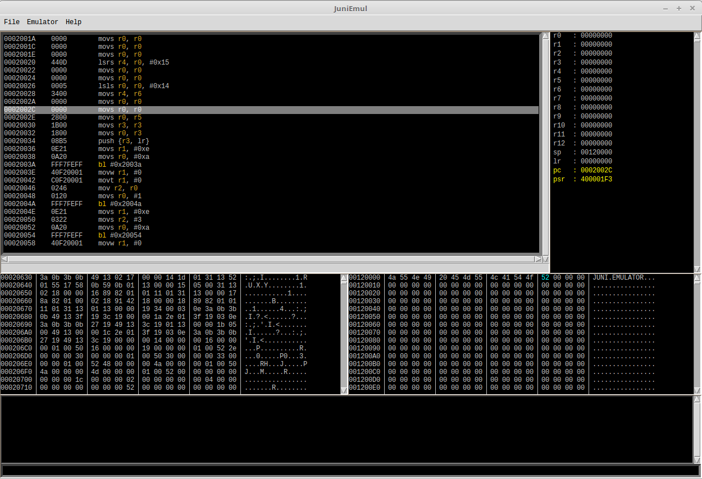

### Overview

**JuniEmu** is an emulator interface designed for ARM 32-bit. 

JuniEmu is using Unicorn framework for emulation, Capstone disassembly framework and Python's standard GUI package - Tkinter.

The goal of the project was to visually emulate (single step, breakpoint, memory view\edit) raw ARM binaries (bootloaders, embedded firmware, standalone functions, etc).

## Features

- Single steeping and breakpoint support 
- Memory view and edit
- Registers view and edit 
- Instruction highlighting

## Commandline cmd
 
`help` - print help

`d <addr>` - dump memory to current view windows e.g. `d 0x1030`

`u <addr>` - unassemble address or register e.g.  `u pc`, `u 0x1030`, `u 0x1031` (disasm 0x1030 in Thumb mode)

`bp <addr>` - set breakpoint

`bc <addr>` - clear breakpoint

`bl` - list breakpoints

`r <register> <value>` - change register value e.g. `r r0 0x101`

`rr` - print registers

`?` - calc expression

`dump <addr> <range> "PATH"` - dump memory range to a file e.g. `dump 0x1030 100 "/Users/bob/Desktop/dump.bin"`

## Question

- How to change program counter register to e.g. 0x1030 (ARM mode) ?

`r pc 0x1030`

- How to change program counter to e.g. 0x1030 (Thumb mode) ?

To switch into thumb mode provide unaligned address (add +1 to the destination address)

`r pc 0x1031`

### Issues

- Not tested with Python 3
- Not fully tested on Windows, MacOS
- Input server will freeze the UI until until receiving bytes from the client

### Dependencies (Python bindings)

- python TkInter (`sudo apt-get install python-tk`)
- Capstone https://github.com/aquynh/capstone
- Unicorn https://github.com/unicorn-engine/unicorn
